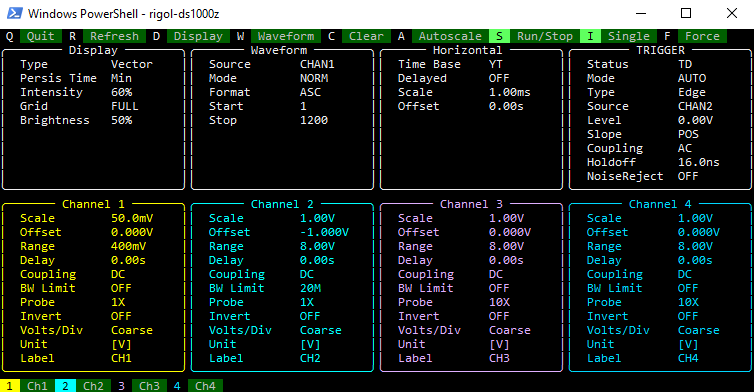
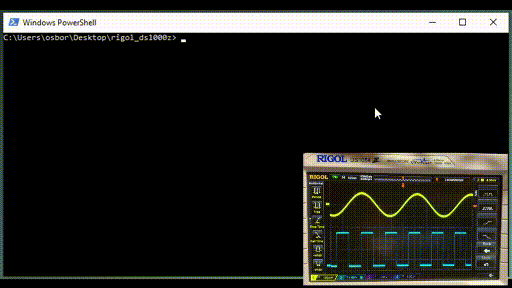

# rigol-ds1000z

## An oscilloscope user interface that never leaves the terminal.





## A simple command line tool for grabbing data and pictures.

```shell
rigol-ds1000z --help
rigol-ds1000z --visa resource --display path/to/file.png
rigol-ds1000z --visa resource --waveform src path/to/file.csv 
```

Unless a VISA resource is specified with the `--visa` argument, the CLI will search for a Rigol DS1000Z series oscilloscope and connect to the first one it finds.

The CLI can capture and save to file an image of the display (`--display`) or the waveform data of the specified source channel (`--waveform`).

## A compact Python interface for automating test procedures.

```python
from rigol_ds1000z import Rigol_DS1000Z
from rigol_ds1000z import process_display, process_waveform

with Rigol_DS1000Z() as oscope:
    # autoscale
    oscope.autoscale()

    # reset to defaults and run self-test
    ieee = oscope.ieee(rst=True, tst=True)

    # print IEEE 488.2 instrument identifier
    print(ieee.idn)

    # configure channels, the horizontal scale, and the trigger
    channel2 = oscope.channel(2, probe=10, coupling="AC", bwlimit=True)
    channel3 = oscope.channel(3, display=True)
    timebase = oscope.timebase(main_scale=1e-3, main_offset=200e-6)
    trigger = oscope.trigger(mode="EDGE", source=3, coupling="DC", level=1.2)

    # send an SCPI command
    oscope.write(":MATH:DISPlay ON")

    # capture the display image
    display = oscope.display()
    process_display(display, filename="display_capture.png")

    # capture the channel 2 waveform data
    waveform = oscope.waveform(source=2)
    process_waveform(waveform, filename="waveform_capture.csv")

```

## Installation instructions and notes to the user.

`pip install rigol-ds1000z`

Available on [PyPI](https://pypi.org/project/rigol-ds1000z/). This package uses [PyVISA](https://pyvisa.readthedocs.io/en/1.12.0/introduction/getting.html) to communicate with the oscilloscope, which requires that the user also installs the National Instrument's VISA library for their operating system.

This software has been tested on Windows (Command Prompt and PowerShell), although it should be possible to run in other shells and/or operating systems. For best visual performance, a default of white text on a black background is recommended.

## Software development and references.

[Read the documentation.](https://amosborne.github.io/rigol-ds1000z/)

[Rigol DS1000Z programming manual.](https://beyondmeasure.rigoltech.com/acton/attachment/1579/f-0386/1/-/-/-/-/DS1000Z_Programming%20Guide_EN.pdf)

| Command Category | Coverage |
| --- | --- |
| AUToscale, etc. | YES |
| ACQuire | no |
| CALibrate | no |
| CHANnel | YES |
| CURSor | no |
| DECoder | no |
| DISPlay | YES |
| ETABle | no |
| FUNCtion | no |
| IEEE 488.2 | YES |
| LA | no |
| LAN | no |
| MATH | no |
| MASK | no |
| MEASure | no |
| REFerence | no |
| STORage | no |
| SYSTem | no |
| TIMebase | YES |
| TRIGger | PARTIAL |
| WAVeform | YES |

- Package management by [Poetry](https://python-poetry.org/).
- Automated processing hooks by [pre-commit](https://pre-commit.com/).
- Code formatting in compliance with [PEP8](https://www.python.org/dev/peps/pep-0008/) by [isort](https://pycqa.github.io/isort/), [black](https://github.com/psf/black), and [flake8](https://gitlab.com/pycqa/flake8).
- Static type checking in compliance with [PEP484](https://www.python.org/dev/peps/pep-0484/) by [mypy](http://www.mypy-lang.org/).
- Test execution with random ordering and code coverage analysis by [pytest](https://docs.pytest.org/en/6.2.x/).
- Automated documentation generation by [sphinx](https://www.sphinx-doc.org/en/master/).

Installing the development environment requires running the following command sequence.

```shell
poetry install
poetry run pre-commit install
```

In order for all tests to pass channel 2 must be connected to the calibration square wave.
